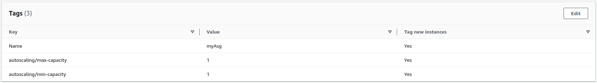

# AWS_Lambda_start_and_stop

This repository aims to provide lambda patterns and their triggers to manage the shutdown and startup cycles of AWS resources. This approach comes in a concern of saving hardware resources and / or financial. The modules is compatible with `AWS EC2 Instances`, `AWS EC2 Auto Scaling Groups` and `AWS RDS`.

## Init Lambda

First it is necessary to clone the project to use the `modules` folder.

The `.tf` files provide configuration examples but must be merge/remove according to th current infrastructure.

The follow the next examples to quickly configure lambda according to your needs.

In each cases the lambda configuration start with the following which create a lambda doing nothing.

To apply configuration use your CI/CD mecanism or just command `terraform init` and `terraform apply`.
## Manage Instances

To manage instance the required argument is `instanceName` followed by a string with all the instance names whitout spaces that you want to manage. 

Ensure instances are tagged with their name.

Then configure `schedule_expression_stop` and `schedule_expression_start` (UTC) to trigger lambda at the right moment.

This configuration will stop `myInstance1` and `myInstance2` at `21:00`(PM) and will start at `08:00`(AM)

All the instances tags with `Key:Name` ; `Value:myInstance1/2` are considered.

## Manage Asg

To manage autoscaling groups the required argument is `asgName` followed by a string with all the asg names whitout spaces that you want to manage. 

Ensure asg are tagged with their name and add `autoscaling/max-capacity` and `autoscaling/min-capacity` to your autoscaling groups.

Then configure `schedule_expression_stop` and `schedule_expression_start` (UTC) to trigger lambda at the right moment.

This configuration will stop `myAsg1` and `myAsg2` at `21:00`(PM) and will start at `08:00`(AM)

## Manage RDS 

To manage RDS cluster the required argument is `dbClusterIdentifier` followed by a string with all the cluster identifiers whitout spaces that you want to manage. 

Then configure `schedule_expression_stop` and `schedule_expression_start` (UTC) to trigger lambda at the right moment.

This configuration will stop `dbCluster1` and `dbCluster2` at `21:00`(PM) and will start at `08:00`(AM)

## Example

It is possible to manage all resources together using each required arguments. 

If you want to manage resources at different moments it is necessary to create other lambda using this modules.

Here `dev` env and `prod` env are managed separetly because of different trigger time expressions.
